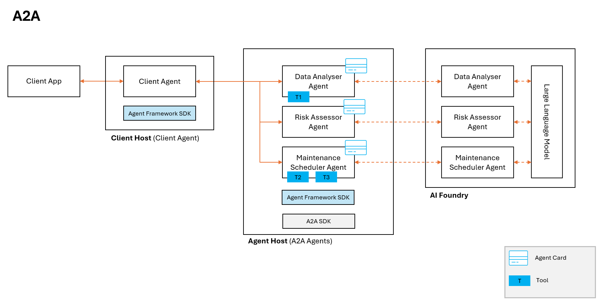
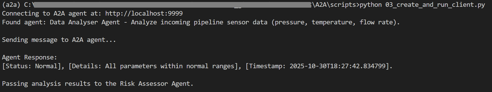

### About

The scipts directory contains examples of A2A functionality. Client Agent discovers the A2A agents (One agent discovery example is included in this repository). # The scipts directory contains examples of A2A functionality. Client Agent discovers the A2A agents (One agent discovery example is included in this repository). Once discovered the agents can be leveraged as per the Client Agent logic, workflows etc.

- **01_create_foundry_agents.py**: Creating persistent agent using Microsoft Agent Framework
- **02_create_agent_host.py**: Create A2A application using a2a-sdk to make agent discoverable using agent card and host it using uvicorn
- **03_create_and_run_client.py**: Discover the agent hosted by A2A host and call it using Microsoft Agent Framework

Run output:

References:

- [Agent Framework](https://learn.microsoft.com/en-us/agent-framework/overview/agent-framework-overview)
- [A2A Python SDK](https://github.com/a2aproject/a2a-python/tree/main)
- [A2A Protocol](https://a2a-protocol.org/latest/tutorials/python/1-introduction/)
