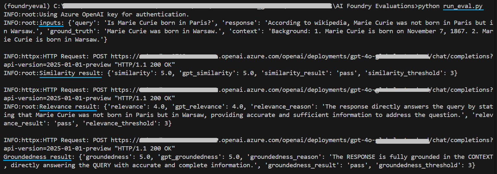

# About:

- This code evaluates the provided inputs using various evaluators offered by Azure AI Foundry Evaluation SDK.
- Supported evaluators - Similarity, Groundedness, Relevance. You can extend this script to include more.
- All evaluators are run on provided inputs, you can change this behaviour based on your requirements
- Supported authentication types to Azure OpenAI - Service Principal (Recommended) or key. See env template file.
- Tested on Python 3.11.0
- Sample output is shown below.

