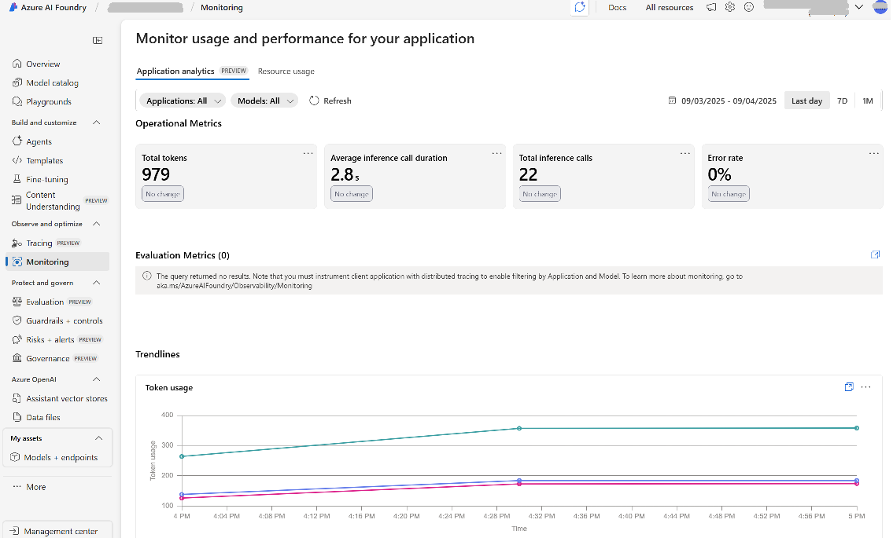
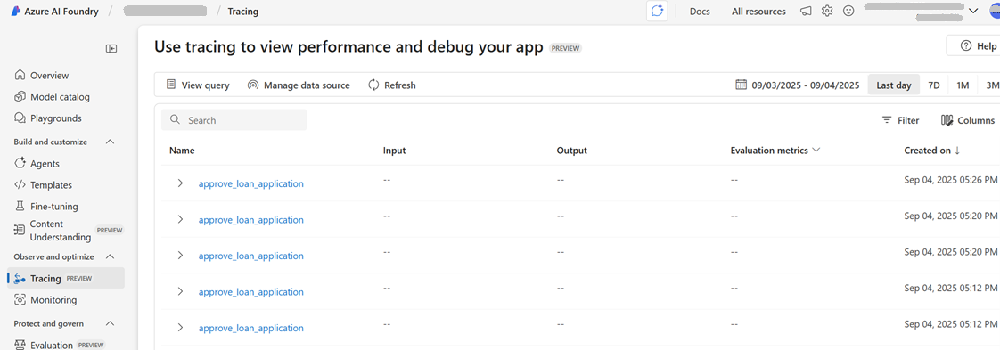
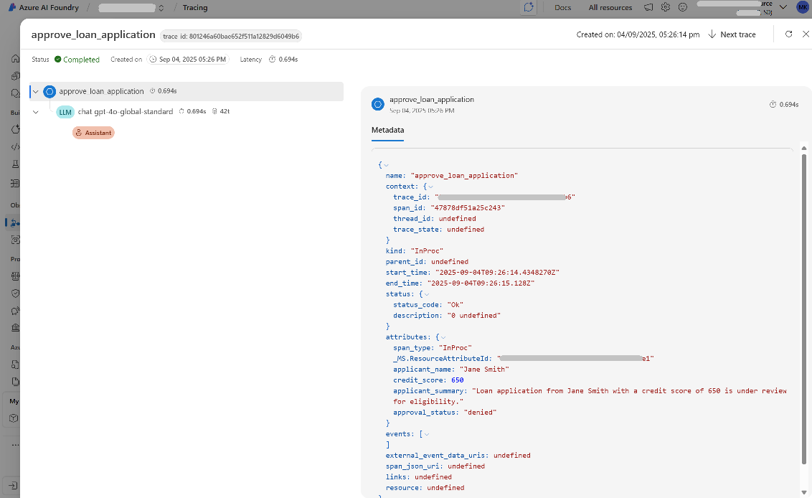

# About

- This code demonstrates how to integrate Azure AI Foundry with OpenTelemetry for tracing and monitoring purposes.
- It shows how to set up tracing for a simple loan application approval process using an Azure OpenAI model and how to send trace data to Azure Application Insights for analysis.
- Connecting Applications Insights to Azure AI Foundry enables monitoring and tracing capability views in Azure AI Foundry portal.
- Tested on Python 3.11.0
- ` python trace_demo.py`
- Sample monitoring and tracing logs from Azure AI Foundry portal are shown below

