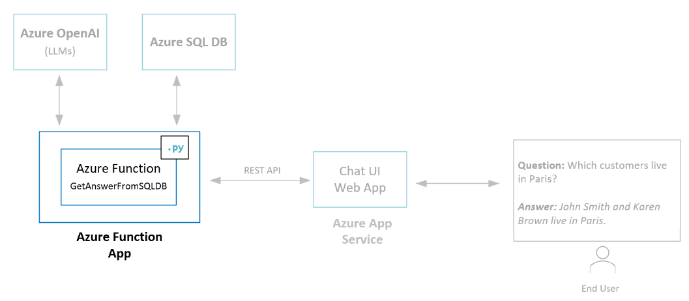

This repository contains miscellaneous script collections.

- <b>/Azure Functions</b>: This directory has Azure Function App projects. 

    - <b>/AzureFunctions/Proj_LLMSQL</b>: 
        - This Azure Function project contains Azure Function/s that articulate a response to natural language question on dataset within an Azure SQL Database tables. The function makes use of LangChain SQLDatabaseToolkit backed by gpt-35-turbo-16k (can work with 4k version too) LLM.
        
        - You require Azure OpenAI and Azure SQL Database resources provisioned beforehand.
        - Ensure the database contains tables (with descriptive names) that you would like to ask questions to.
        - This function can be called by any front-end application to render output.
        - To run this Azure Functions project locally
            - [Install necessary prerequsites for Azure Functions](https://learn.microsoft.com/en-us/azure/azure-functions/create-first-function-cli-python?tabs=bash%2Cazure-cli&pivots=python-mode-configuration)
            - Create a local python virtual environment.
            - ```pip install -r requirements.txt```
            - Rename _local.settings_template.json_ file to _local.settings.json_ and update the values in this file.
            - Open this repository in VS Code.
            - Open VS Code terminal and navigate to \miscellaneous\Azure Functions\Proj_LLMSQL directory
            - ```func start```
            - Open Postman and create a new post request to the URL displayed in the terminal
                - Ensure that the question to the database is included in the request body
                - Request body example: {"question":"Which customers live in Paris?"}
                - Ensure to include function key as x-functions-key in the request header.
        - To deploy to Azure Function App
            - Create Azure Function App (Python 3.9)
            - Open VS Code terminal and navigate to \miscellaneous\Azure Functions\Proj_LLMSQL directory
            - ```az login```
            - ```az account set --subscription [Your Subscription ID]```
            - ```func azure functionapp publish [Your function app name]```
            - Update application settings.